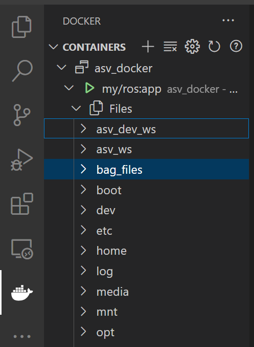

# Tutorial de desarrollo de nodo

Este tutorial supone que ya ha generado la imagen según el [tutorial](Readme.md). Si no ha incluido su propia carpeta puede continuar este tutorial utilizando la carpeta [bag_files](bag_files).

## Pasos Previos

Antes de ejecutar el contenedor, puede generar o agregar ficheros en la carpeta bag files de este repositorio. Por ejemplo, en linux puede realizar

```bash
cd bag_files
touch ejemplo.txt
```

Lo cuál genera un fichero dentro de la carpeta bag_files. Este fichero podrá ser editado dentro del docker más adelante.

## Uso de volúmenes en docker

Cuando ejecute el docker puede abrir una nueva terminar y acceder a la línea de comandos de ese docker mediante:

```bash
docker exec -it asv_docker bash
```

Normalmente, la línea de comando de sitúa en la carpeta bag_files por defecto, por lo que puede visualizar que el fichero de ejemplo se encuentra dentro de este fichero utilizando

```bash
ls
```

Verifique que los paquetes del ASV se han instalado correctamente:

```bash
ros2 pkg list
```

o bien

```bash
ros2 pkg executables
```

La imagen que ha generado no incluye ningún editor de texto, pero, por ejemplo, puede utilizar [Visual Studio Code](https://code.visualstudio.com/docs/containers/overview) para editar ficheros dentro de contenedores.
Instale la extensión docker. Abra el fichero a través de la pestaña  que se encuentra en el barra izquierda.



Además de la carpeta bag_files, en el ejemplo de la figura, se ha agregado la carpeta asv_dev_ws que contiene un directorio preparado para generar un paquete válido para ROS2. Puede crear y modificar cualquier fichero dentro de las carpetas del volumen. Los cambios que realice dentro del contenedor también actualizarán a los ficheros que estén en su host.

## Instalación y utilización de paquetes en ROS2

Si ha creado un paquete en ros, puede dirigirse a la carpeta principal e instalar el paquete utilizando

```bash
colcon build
source install/setup.sh
```

Luego ejecute el módulo:

```bash
ros2 run <pkg-name> <executable-name>
```

Para más información, dirígase al [Tutorial de creación de paquetes](https://docs.ros.org/en/humble/Tutorials/Beginner-Client-Libraries/Creating-Your-First-ROS2-Package.html)
